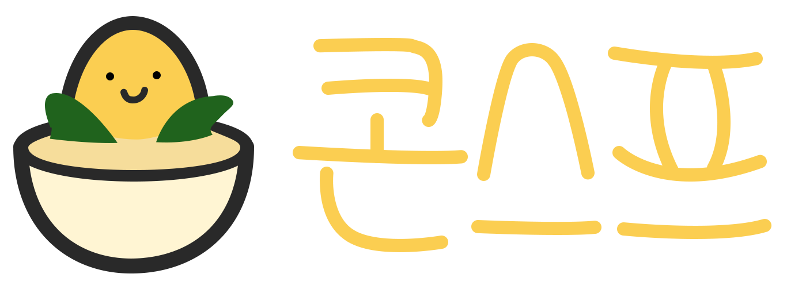

# contiStoryPrompt PROJECT

## 🖥 프로젝트 소개
이미지 생성형 AI인 stable diffusion모델을 사용하여 conti를 생성하고 편집할 수 있도록 제공하는 웹사이트
 

## 🕰 개발 기간
* 23.11. 1 - 

### ⚙ 개발 환경

- **Front-end** : React / CSS /HTML
- **Back-end** : Node.js
- **Framework** : Express, FLASK
- **Database** : MySQL

## 📌 주요 기능
### 메인화면

### 이미지생성

### inpaing 편집
